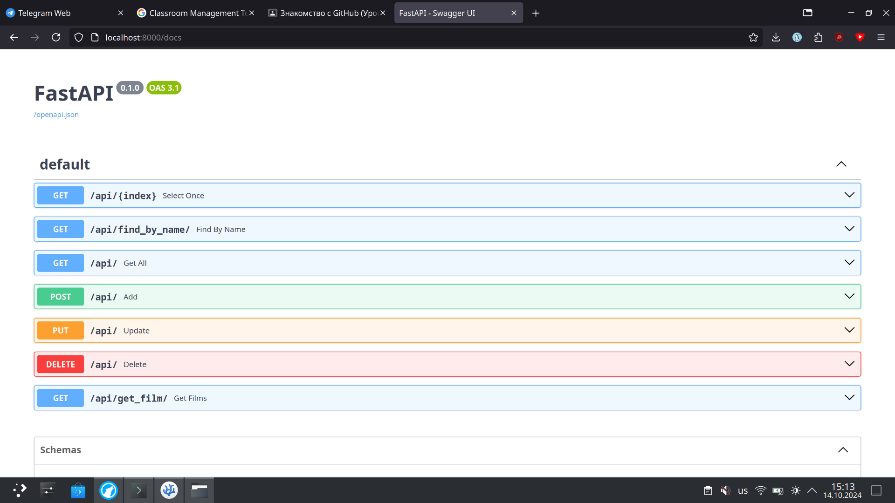

# Project API

Индивидуальный проект по теме: Создание приложения, которое позволяет пользователям смотреть фильмы, сериалы, документальные фильмы через интернет, возможно с подпиской или оплатой за просмотр

Для использования продукта требуется Python.

Для запуска API требуется предварительно установить зависимости для Python:\
python -m pip install -r requirement.txt

И запустить API:\
python main.py

